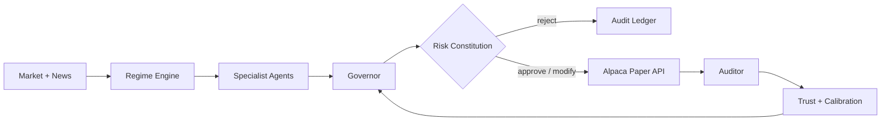

# AlphaGovernor

**The operating system that hires, funds, evaluates, and fires AI traders.**

AlphaGovernor is an autonomous capital command center for the Alpaca AI Trading Agents Hackathon. Instead of trusting one general-purpose trading bot, it governs a workforce of specialist agents. A Governor dynamically allocates capital, a deterministic Risk Constitution retains final authority, and an Auditor turns outcomes into reputation, probation, and reallocation.

> Educational paper-trading software only. Nothing in this repository is investment advice, and live trading is intentionally unsupported.

## The memorable minute

1. The regime engine identifies a trending bull market.
2. Momentum proposes an NVDA trade and earns capital.
3. The Risk Guardian vetoes a $20,000 TSLA request because only $8,400 is constitutionally permitted.
4. Mean Reversion produces another high-confidence failure.
5. Its trust falls from 57 to 49; the Governor puts it on probation and returns $4,500 to cash.
6. Momentum exits profitably, its trust rises from 81 to 86, and capital is reallocated automatically.

Replay Lab delivers the complete lifecycle at 50× speed, so the demo does not depend on a busy live market.

## Product surfaces

- **Mission Control** — portfolio telemetry, live regime, capital authority, agent reputation, and the immutable decision feed.
- **Decision Room** — proposal → Governor → Risk Guardian → Alpaca Paper → Auditor, with inspectable evidence for every event.
- **Replay Lab** — a deterministic accelerated market session built for a one-minute judging demo.
- **Risk Constitution** — hard-coded position, agent, sector, loss, drawdown, data-freshness, stop, and confidence requirements.
- **AI Auditor** — optional OpenAI Responses API integration that explains deterministic decisions using strict Structured Outputs. It has no execution authority.
- **Alpaca Paper adapter** — account sync and bracket-order submission; the server refuses any non-paper Alpaca hostname.

## Architecture



The dividing line is deliberate: calculations, limits, and order state are deterministic; models may interpret, critique, and explain but cannot modify policy or submit orders directly.

## Run locally

Requirements: Node.js 20.9 or newer.

```bash
npm install
npm run dev
```

Open [http://localhost:3000](http://localhost:3000). Replay mode works without any credentials.

For optional integrations:

```bash
copy .env.example .env.local
```

Add Alpaca **paper** credentials and/or an OpenAI API key. Secrets remain server-side. `ALPACA_PAPER_BASE_URL` is validated against `https://paper-api.alpaca.markets`, and there is no live-trading switch.

## Verify

```bash
npm test
npm run lint
npm run build
```

## API surface

| Route | Purpose |
| --- | --- |
| `GET /api/health` | Reports replay/paper/model capability without exposing secrets. |
| `GET /api/alpaca/account` | Returns a normalized Alpaca paper account snapshot. |
| `POST /api/alpaca/orders` | Validates a proposal, applies the Risk Constitution, then submits a paper bracket order. |
| `POST /api/ai/briefing` | Produces a schema-validated explanation or a deterministic fallback. |

## Risk Constitution

| Rule | Limit |
| --- | ---: |
| Risk per trade | 0.5% |
| Position size | 10% |
| Sector exposure | 30% |
| Single-agent capital | 35% |
| Daily loss | 2% |
| Portfolio drawdown | 5% |

Every proposal also requires fresh data, at least 55% confidence, evidence, a stop, a take-profit target, and sufficient buying power. Material reductions are rejected and must be resubmitted; modest reductions can be automatically clamped before paper execution.

## Hackathon fit

The official challenge asks builders to create autonomous agents and trading apps on Alpaca’s developer stack in the paper environment. AlphaGovernor uses the Trading API boundary for execution and turns multi-agent accountability into the product itself. See [Submission Kit](docs/SUBMISSION.md), [Demo Script](docs/DEMO_SCRIPT.md), and [Architecture](docs/ARCHITECTURE.md).

Official references: [hackathon challenge](https://lablab.ai/ai-hackathons/alpaca-ai-trading-agents-hackathon), [Alpaca authentication](https://docs.alpaca.markets/us/docs/authentication), [Trading API orders](https://docs.alpaca.markets/reference/postorder), and [OpenAI Responses API](https://developers.openai.com/api/reference/cli/resources/responses/methods/create).

## License

MIT — a requirement-compatible open-source license for the event submission.
