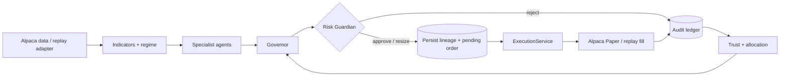

# AlphaGovernor

AlphaGovernor is a paper-trading control plane for autonomous strategies: specialist agents propose, a deterministic Governor allocates authority, a deterministic Risk Guardian has final veto power, and only `ExecutionService` can reach Alpaca Paper.

> Educational paper-trading software only. Live trading is intentionally unsupported.

## Why it is different

- Four bounded agents: Momentum, Mean Reversion, News Intelligence, and Defensive.
- Deterministic indicators, regime, trust, allocation, ranking, risk, sizing, and P&L.
- Exact proposal → Governor → Risk → persisted pending order → Alpaca Paper lineage.
- Invalid or unavailable AI output becomes an abstention. AI cannot size, approve, or execute.
- Unknown placement outcomes reconcile by deterministic `client_order_id`; submissions are never blindly retried.
- One orchestration engine powers live-paper cycles and Replay Lab. Replay never calls Alpaca execution.
- Mission Control, Decision Room, workforce, Risk Constitution, SSE audit, replay proof, and risk-off control.

## Architecture



The pnpm/Turborepo workspace contains:

- `apps/web` — Next.js 16 command center.
- `apps/api` — Fastify 5 API, operator controls, SSE, BullMQ, and orchestration.
- `packages/contracts` — shared Zod contracts.
- `packages/db` — Prisma/PostgreSQL financial lineage, migration, and seed.
- `packages/indicators`, `agent-core`, `risk-core` — deterministic decision engine.
- `packages/alpaca` — guarded Alpaca Paper, mock, and replay adapters.
- `packages/config` — fail-closed environment validation.

## Fastest local demo

Requirements: Node.js 22+ and Corepack.

```bash
corepack pnpm install
corepack pnpm dev
```

Open [http://localhost:3000](http://localhost:3000), enter Replay Lab, and click **Run the market**. The judge-facing story runs immediately; with the API available the button also executes a deterministic server replay and reports `PROOF COMPLETE`.

Replay requires no credentials. Live-paper cycles remain paused and fail closed without PostgreSQL and healthy provider state.

## Full stack with containers

```bash
copy .env.example .env
docker compose up --build
```

This starts PostgreSQL, Redis, the API on port 4000, and web on port 3000; applies the committed migration; seeds the agents and Risk Constitution; and leaves paper execution paused until an authenticated operator resumes it.

Set only Alpaca **paper** credentials. Startup rejects `ALPACA_PAPER=false` and any trading hostname other than `paper-api.alpaca.markets`.

## Verification

```bash
corepack pnpm typecheck
corepack pnpm lint
corepack pnpm test
corepack pnpm build
```

## API highlights

Responses use `{ data, meta? }` or `{ error: { code, message, correlationId } }`. State-changing routes require `x-operator-token` or a bearer token.

| Route | Purpose |
| --- | --- |
| `GET /api/v1/health` | Paper-only health and dependency state |
| `GET /api/v1/system/status` | Run/pause/risk-off state |
| `POST /api/v1/system/{pause,resume,kill}` | Operator controls |
| `GET /api/v1/{account,positions,orders}` | Normalized broker state |
| `GET/PATCH /api/v1/agents/:id` | Workforce authority and lifecycle |
| `POST /api/v1/decisions/run` | Live-paper or replay cycle |
| `GET/PATCH /api/v1/risk/profile` | Risk Constitution |
| `POST /api/v1/replays` | Shared-engine accelerated proof |
| `GET /api/v1/events` | Server-sent audit and decision events |

See [Architecture](docs/ARCHITECTURE.md), [90-second Demo Script](docs/DEMO_SCRIPT.md), and [Submission Kit](docs/SUBMISSION.md).

## License

MIT.
